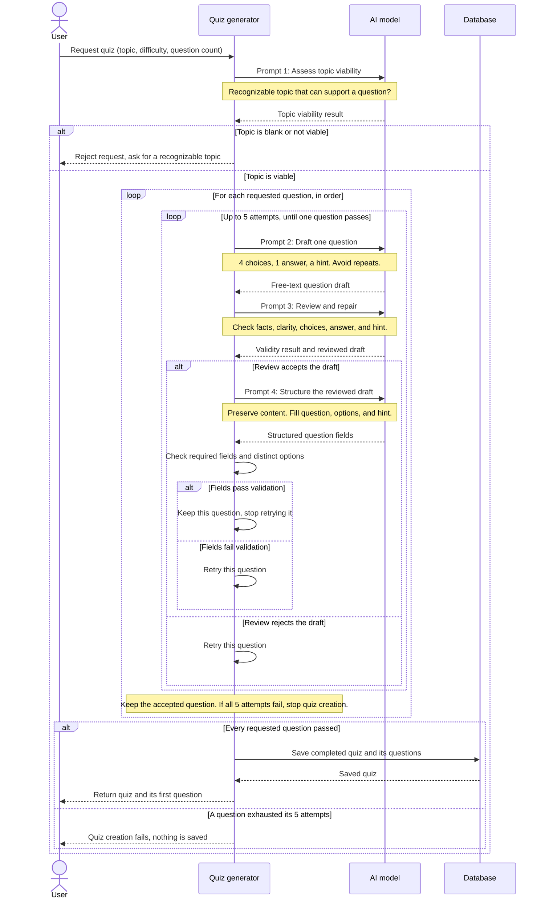

# Quiz generation: prompt flow

This sequence focuses on the prompts and their purpose. The request supplies a topic, difficulty, and question count (3, 5, or 7).

## Sequence diagram

If a question-generation call (Prompts 2-4) errors, the review rejects a draft, or the structured fields fail validation, the generator retries that question from Prompt 2, up to five attempts. Questions are generated in order so later draft prompts can avoid earlier questions. The quiz is saved only after every requested question succeeds.

## What each prompt is for

1. **Assess topic viability:** Prevents spending the generation steps on blank, gibberish, or unrecognizable topics. It returns a yes/no decision, not a quiz question.
2. **Draft one question:** Produces a question of about 30 words or fewer for the requested topic and difficulty, with four choices, one intended correct answer, and a hint. It also receives earlier question texts to reduce repetition.
3. **Review and repair:** Checks the draft for factual accuracy, clarity, four distinct choices, one defensible correct answer, and a useful accurate hint. It may fix the draft; if it cannot make a valid question confidently, it rejects it so the generator can retry.
4. **Structure the reviewed draft:** Converts the accepted text into separate `question`, `optionA`-`optionD`, and `hint` fields while preserving its content. It does not produce the answer key; the correct option is determined later when the user answers the question.
